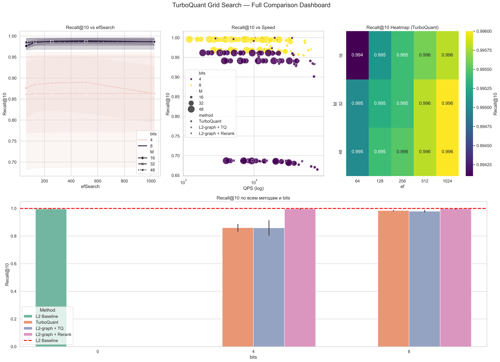
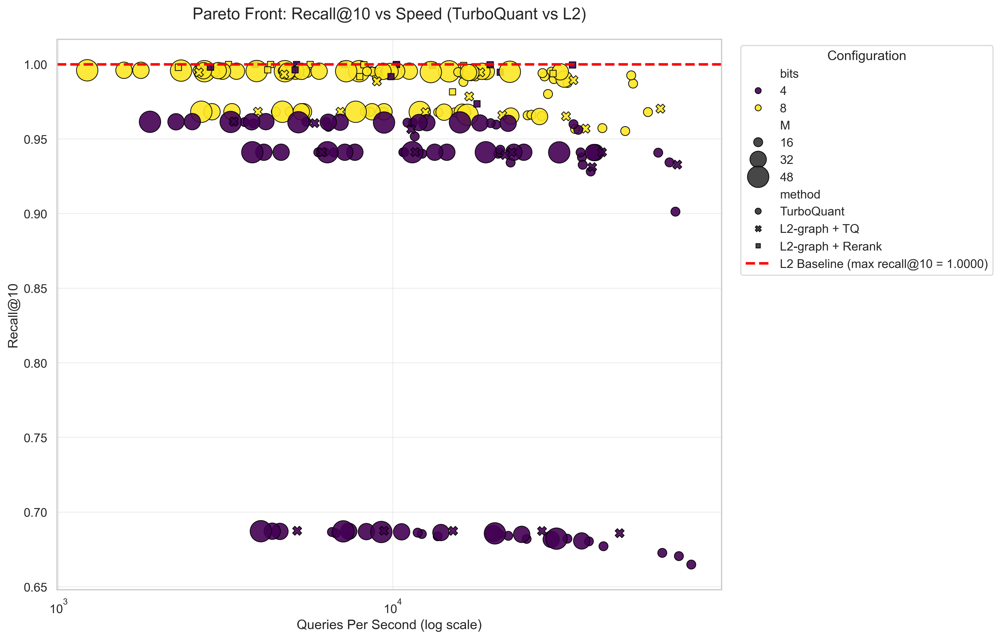

# Parameter Selection Guide
Choosing the right parameters for TurboQuant involves balancing three factors: Accuracy (Recall), Memory Usage, and Search Speed (QPS).
## 1. Quantization Level (bits_per_coord)

| Value | Accuracy | Best For | Recommendation |
|---|---|---|---|
| 8 bits | High    | General use, high-precision search | Recommended Default. Matches L2 accuracy (Recall@10 ~0.96+) while being 1.5–2x faster. |
| 4 bits | Low/Med | Massive datasets with Reranking | Significant accuracy "ceiling" (Recall@10 ~0.68 on SIFT). Use only if memory is critical and a second-stage rerank is applied. |

## 2. HNSW Graph Parameters
### M (Number of Bi-directional Links)

* Range: 16 – 48
* Default: 32
* Impact: Higher M improves recall on high-dimensional data but increases memory footprint and construction time.
* Sweet Spot: 32 provides diminishing returns beyond this point for 8-bit quantization.

### efConstruction (Build Depth)

* Range: 200 – 400
* Default: 400
* Impact: Controls the quality of the graph during indexing.
* Observation: Increasing beyond 400 significantly slows down indexing with negligible recall gains for quantized spaces.

### efSearch (Search Depth)

* Range: 128 – 512
* Impact: Direct trade-off between QPS and Recall.
* Tuning: Use 128 for maximum throughput; use 512 to hit the accuracy ceiling.

## 3. Recommended Configuration Presets

| Preset        | bits | M | efC | efS | Target Use Case |
|---------------|------|---|-----|-----|---|
| Fast          | 8    |  16 | 200 | 128 | Maximum throughput (Recall ~0.95) |
| Balanced      | 8    |  32 | 400 | 256 | Production Default (Recall ~0.97) |
| High Quality  | 8    |  32 | 400 | 512 | Maximum possible precision |
| Aggressive    | 4    |  32 | 400 | 512 | Memory-constrained + Reranking |

### How to Using

```python
from turboquant.presets import create_index_with_preset

space, index, preset = create_index_with_preset(dim=128, preset_name="balanced")

# or

preset = get_preset("high_quality")
space = TurboQuantSpace(dim=128, bits_per_coord=preset.bits_per_coord)
```

### Summary of Findings

* The 4-bit Ceiling: On SIFT-like datasets, 4-bit quantization faces a mathematical accuracy limit (~0.68 Recall) due to distance approximation errors, regardless of how high you set HNSW parameters.
* Efficiency: TurboQuant 8-bit typically provides a 1.6x - 2.2x speedup over standard FP32 L2 distance with negligible loss in precision.


## Comparsion dashboard




## Pareto graph


